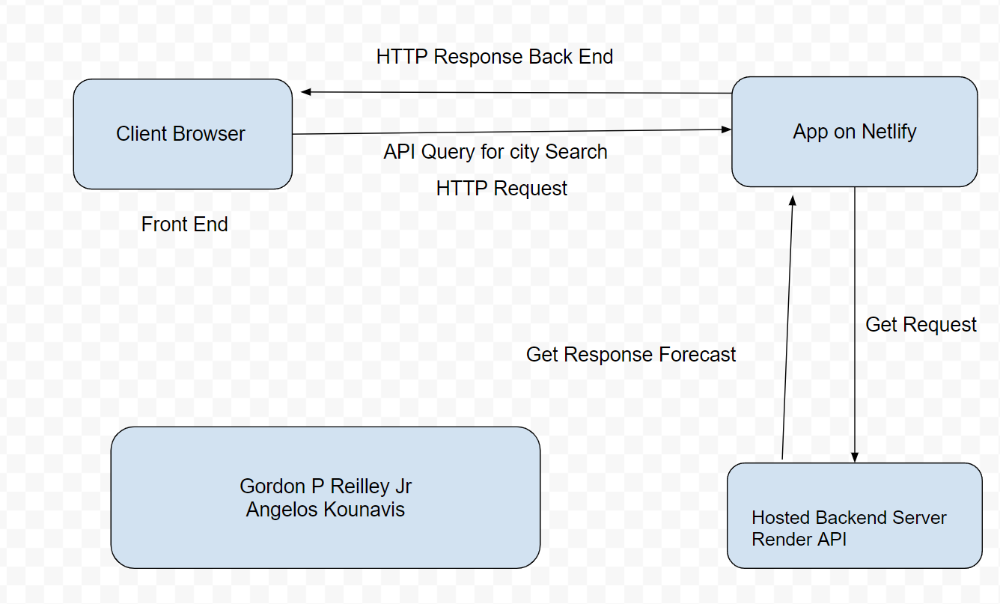

# city-explorer-api

**Author**: Gordon P Reilley Jr
**Version**: 1.0.0

## Overview
<!-- Provide a high level overview of what this application is and why you are building it, beyond the fact that it's an assignment for this class. (i.e. What's your problem domain?) -->
A custom API server, which provides data for the City Explorer front-end application. Users will get to see not only the map, but also interesting information about a specified City, provided by a variety of third-party APIs.

## Getting Started
<!-- What are the steps that a user must take in order to build this app on their own machine and get it running? -->

## Architecture
<!-- Provide a detailed description of the application design. What technologies (languages, libraries, etc) you're using, and any other relevant design information. -->
Languages used: JavaScript

Libraries used: Node.JS

## Change Log
<!-- Use this area to document the iterative changes made to your application as each feature is successfully implemented. Use time stamps. Here's an example:

01-01-2001 4:59pm - Application now has a fully-functional express server, with a GET route for the location resource. -->

1. Feature 1: Set-up Project and ReadMe

    - Estimate of time needed to complete: 2 hrs

    - Start time: 6:45 P.M. EST

    - Finish time: 9:50 P.M. EST

    - Actual time needed to complete: 3 hr 5 min

    - Brief description of changes implemented: Updated ReadMe for GitHub and crated repository, while also adding live port capabilities.

## Credit and Collaborations
<!-- Give credit (and a link) to other people or resources that helped you build this application. -->

- Collaborated with **Angelos Kounavis** on the WRRC Diagram.
